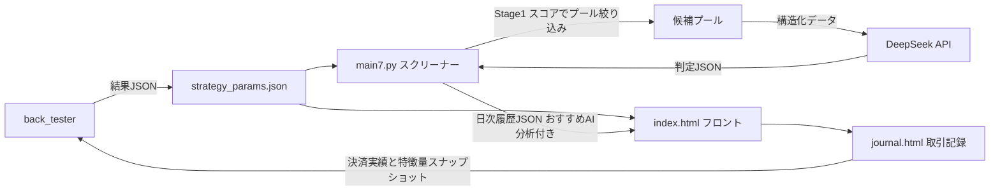

# Stock_app 改善計画（クリーン版）

> 本ドキュメントは、重複・矛盾していた旧版を整理し直した統合版です。
> バックテスト側の詳細戦略は [`back_tester/BACKTEST_STRATEGY_PLAN.md`](../back_tester/BACKTEST_STRATEGY_PLAN.md) を参照してください。
> 本計画の実装優先順位は、ワークスペースのtodoリストと同期しています。
>
> ⚠️ **この文書は設計方針です。実装により一部内容が古くなっています。最新の実装状況・残タスクは [`PROJECT_STATUS.md`](PROJECT_STATUS.md) を参照してください。**

---

## 0. 目的と適用範囲

本プロジェクトは、日本株の候補銘柄を自動抽出し、割安性・収益性・テクニカルの観点から評価して保存・通知する仕組みです。本計画の目的は、以下の3つを「連動」させて選定精度を上げることです。

- **スクリーナー本体**: [`Stock_app/main6.py`](main6.py)（刷新後は新設する [`main7.py`](main7.py)）
- **フロントエンド**: [`Stock_app/docs/index.html`](docs/index.html)（+ [`journal.html`](docs/journal.html)）
- **バックテスト**: [`back_tester/backtest_scanner_v2.py`](../back_tester/backtest_scanner_v2.py) ほか

最終的な目指す姿は、バックテスト等の指標をもとに**週 3〜5 銘柄程度**の「おすすめスイング銘柄」を、**AI の戦略提言付きで自動表示**することです。推薦件数は実データの数値次第で変動します。

### 0-1. 現行動作の保持（最重要の運用前提）

- **現行の [`main6.py`](main6.py) は刷新完了まで無変更で動かし続ける**（毎日のスクリーニング・データ反映・`index.html` での閲覧を継続）。
- 刷新版は **新規ファイル [`main7.py`](main7.py) として並行実装**する。`main6.py` を上書きしない。
- バックテストも**既存ファイルは残し、新規ファイルを追加**する方式とする。
- 切替は、新戦略がバックテストで旧戦略を有意に上回ることを確認した後に実施する。

---

## 1. 現状分析

### 1-1. 現状の処理フロー

- JPX 上場銘柄一覧の取得
- 直近 90 日の OHLCV 取得
- 1 銘柄ごとのファンダメンタル情報取得
- PER / PBR / ROE / 営業利益率 / 配当利回りの計算
- GC（ゴールデンクロス）と出来高拡大の評価
- 複数条件で候補の抽出
- SQLite と JSON への保存
- Discord への通知
- 詳細画面でのフィルタリングと分析支援

### 1-2. 現状の強み

- ファンダメンタルとテクニカルを両立している
- GC と出来高増加率を組み合わせている
- 価値株とスイング株を分離している
- SQLite / JSON で履歴管理ができる
- UI 上で検索・フィルタ・絞り込みができる

### 1-3. 現状の弱み（コード実態ベース）

- **閾値・PF値が複数箇所にハードコードされている**: [`send_to_discord()`](main6.py:358)・[`evaluateSignal()`](docs/index.html:351)・[`applyPresetPattern()`](docs/index.html:409) に同一ルールが重複し、変更時にズレが生じる
- **株価帯定義が不整合**: バックテスト各スクリプトと UI の帯区分が一致していない
- **総合スコアが弱く**、個別指標の固定閾値評価が中心
- **週足・月足・業種・相場環境の評価が未実装**
- **実取引の成績が学習に戻らない**: 取引記録は [`localStorage`](docs/journal.html:392) に閉じており、バックテストに接続されていない
- **バックテスト結果の反映経路がない**: 結果は CSV / GitHub Summary 出力までで、スクリーナ・フロントへの自動反映手段がない
- **AI 分析が手動**: 現状はプロンプトのコピー＆手動貼り付けであり、自動分析・自動表示になっていない

---

## 2. 設計原則（最重要の前提）

### 2-1. 役割の分離

| 役割 | 担当 |
| :--- | :--- |
| 候補選定（Stage 1） | スクリーナー + バックテスト指標 |
| 戦略提言（Stage 2） | DeepSeek（構造化データ入力） |
| チャート見える化 | UI |
| 学習・成績管理 | 履歴ログ + バックテスト |

### 2-2. 最終判断は人間、AI は補助

- AI は「自動取引」や「候補の最終決定」は行わない。
- スクリーナーが候補を絞り、AI が戦略提言で補助し、人間が最終判断する。
- この順序を崩すと説明責任と運用の透明性が落ちるため、順序を固定する。

### 2-3. AI への入力は構造化データ、画像は渡さない

- AI には数値中心の構造化データのみを渡す。
- チャート画像は人間の最終確認用に表示し、AI 入力には使わない。
- AI の判定結果をチャート上に注釈として重ねるのは「出力の視覚化」であり、AI への入力ではない。

### 2-4. 検証可能層と未検証層の分離

- **検証可能層**: 価格・出来高・移動平均・GC・売買代金・週足/月足など、時系列で正確に取得できる技術指標。バックテストで精度を主張できるのはこの層のみ。
- **未検証層**: PER / PBR / ROE 等のファンダメンタル（yfinance の値は現在時点のものであり、過去時点へ流用すると先読みバイアスが生じる）。スクリーナーの絞り込みには使えるが、バックテスト精度の根拠にはしない。

両者を同じスコアに混ぜると精度の主張が曖昧になるため、スコア設計上も層を明示する。

---

## 3. 改善の方向性

### 3-1. 固定閾値から「総合スコア」へ

固定閾値は運用しやすい一方で相場変化に弱いため、以下を 100 点満点相当でスコア化する。

- 価格帯適正性
- ファンダメンタル品質（未検証層として分離）
- 流動性
- トレンド強度
- リスク回避
- 履歴ベースの成績

**方針**: スコアでランキングして上位を候補にし、一定のリスク条件はスコアによらず除外する（2層構造）。

```text
候補抽出スコア（加点）:
- 週足上昇トレンド
- 日足 GC
- 5日平均売買代金
- 出来高増加率
- 割安度

安全装置 / 除外ルール:
- 週足が悪化している → 除外
- 直近高値圏で過熱している → 除外
- 低位株・中位株で出来高4倍超 → 監視
- 大きな陰線が出ている → 監視
```

### 3-2. 業種別・価格帯別・相場環境別の補正

- 業種ごとに PER / PBR / ROE の解釈が異なるため、業種中央値による相対評価を導入する。
- 価格帯ごとに適正なスコア係数・利確/損切幅を設ける。
- 相場全体のボラティリティやトレンド（レジーム）を補助変数として持つ。
- ただしファンダメンタル補正は「未検証層」であることを常に明記する。

### 3-3. 週足・月足評価の追加

- 週足で上昇トレンドがあるか
- 週足の移動平均が順行しているか
- 月足で天井圏に近いか
- 直近の調整が浅いか
- 週足の出来高が増えているか

日足で良く見えても週足が崩れている銘柄は除外し、日足が弱くても月足が強い銘柄は上位に寄せる。

### 3-4. 履歴ベースの再最適化

必要な記録:

- 取引記録（買付日・売却日・株価・株数・決済理由）
- エントリー時点の特徴量スナップショット（GC日数・増加率・株価帯・業種など）
- その後の利益・損失・保有期間
- 利確・損切の成立率

これを蓄積し、バックテストに戻すことで条件の有効性を定量的に検証する。

### 3-5. リスク回避ルール

- 高値圏での買いを避ける
- 出来高が急増した銘柄を警戒する
- 直近の大陰線がある場面では慎重にする
- 週足が悪化している銘柄は対象外にする
- 価格帯が高すぎる銘柄はノイズが大きいため除外する

---

## 4. AI 連携の設計（2段階ファネル）

### 4-1. 全体像

推薦フローを2段階に分ける。第1段階は無料のローカル計算、第2段階のみ DeepSeek の従量課金を使う。

- **Stage 1（無料・ローカル）**: バックテスト検証済みの技術スコアでプールを絞る
- **Stage 2（DeepSeek・従量課金）**: プール内の銘柄を自動で戦略提言分析し、推奨度付きでランク付け
- **最終出力**: 週 3〜5 銘柄程度（数値次第）を「おすすめスイング銘柄」として自動表示

### 4-2. Stage 1: 適応的絞り込み

- 目標プールは **20〜40 銘柄** をデフォルトとする。
- 候補が少なすぎる場合は、スコア下限・GC 条件・出来高条件を**自動で緩和**する。
- 候補が多すぎる場合は、同じ条件を**自動で厳格化**する。
- 安全装置（週足悪化・過熱天井の除外）はスコア調整に関わらず常に維持する。

### 4-3. Stage 2: DeepSeek による自動戦略提言

- スクリーナー本体（刷新版 [`main7.py`](main7.py)）が**裏側で DeepSeek を呼ぶ**（ブラウザではなくサーバー側実行）。
- 入力: 構造化データのみ（コード / 業種 / 株価 / 移動平均 / GC / 出来高 / 週足・月足傾向 / スコア内訳 / バックテスト文脈 / 直近の決算予定）。
- 出力: JSON（推奨度 `recommend` / `neutral` / `avoid`、根拠、エントリータイミング、サポート / レジスタンス、リスク注意）。
- 結果は SQLite / 日次 JSON に保存し、**フロントが自動表示**する（手動コピー・手動分析は不要）。
- 画像は AI に入れない。人間向けチャートは別途表示する。
- AI には「予測」ではなく「チェックリスト検証」（トレンド / サポート・レジスタンス / 決算リスク / 流動性 / 相対力 / 業種文脈）を求める。

### 4-4. 最終推薦の選定

- 総合ランク = 技術スコア × AI 判定（例: `recommend` +2 / `neutral` 0 / `avoid` -2）。
- 上位 3〜5 銘柄 / 週を「おすすめ」として提示する。
- 候補が足りない場合や AI 障害時は、技術スコアのみでも推薦を表示する（フォールバック）。
- AI 判定はすべて記録し、`recommend` 銘柄が実際に `avoid` 銘柄を上回るか事後検証して**キャリブレーション**する。

### 4-5. コスト設計と予算ガード（月 1000 円以内）

- DeepSeek V3 概算: 1 銘柄あたり入力約 2,000 トークン・出力約 700 トークンで、**約 ¥0.2 前後 / 銘柄**。
- 週 30 銘柄 → 約 ¥6 / 週、**月 約 ¥24 程度**。月 1000 円に十分収まる。
- 全銘柄（約 4000 銘柄）を毎日 AI 分析すると月数万円になるため**実施しない**（必ず Stage 1 で絞る）。
- `strategy_params.json` に `monthly_budget_jpy` / `max_calls_per_run` を持ち、超過時は技術スコアのみで推薦する。
- API キーは環境変数 / GitHub Secrets で管理する（現在 [`deep_seek_api.txt`](../deep_seek_api.txt) に平文配置されている場合は移管する）。

---

## 5. 3者連動アーキテクチャ

### 5-1. 単一情報源の導入

閾値・株価帯・利確/損切・保有日数・警告ルール・スコア重みに加え、**AI 連携設定（有効化・モデル・Stage 1 プールサイズ・週間推薦件数・月間予算・1実行あたりの最大呼び出し数）** も、共有パラメータファイル **`strategy_params.json`** に集約する。

- **現行 [`main6.py`](main6.py) は変更せず、このファイルを読まない**（現行動作を守る）。
- 刷新版 [`main7.py`](main7.py) が起動時に読み込む。
- フロントエンドは fetch して読み込む。
- バックテストは同じファイルからパラメータ候補を展開する。
- AI 連携（DeepSeek）は同じファイルの `ai` セクションを参照する。

これにより、ルール変更も AI 予算・推薦件数の変更も1ファイルの更新で全コンポーネントに反映される。

### 5-2. データフロー



### 5-3. データ契約

- バックテストは結果を「人間向け CSV / サマリ」に加え、**機械可読な結果 JSON** として出力する。
- 結果 JSON には、最適パラメータ・未見期の期待値 / PF / 勝率 / 件数 / リスク指標・算出日を含める。
- 再評価の頻度は **週次（土曜夜・軽量ウォークフォワード）/ 月次（広域探索）/ 四半期（戦略見直し）** とし、反映は「未見期PF・最低取引数・ベンチマーク上回り・前版比」の自動ガードを通過した場合のみ Git コミットで行う。
- この結果 JSON を `strategy_params.json` へ反映する手順を定型化する（詳細は [`BACKTEST_STRATEGY_PLAN.md`](../back_tester/BACKTEST_STRATEGY_PLAN.md)）。

### 5-4. 移行方針（現行を止めない）

1. `main6.py` はそのまま毎日実行し、`docs/history/*.json` への書き出しと `index.html` 閲覧を継続する。
2. `main7.py` を新規に実装し、当初は `main6.py` と**並行稼働**させる（出力先 JSON を分けるか、タグで共存させる）。
3. バックテストで新戦略が旧戦略を上回ることを確認した後に、Discord 通知とフロントの既定表示を `main7.py` 側へ切り替える。
4. 切替後も `main6.py` は当面残し、問題発生時に戻せるようにする。

### 5-5. 実行時間と運用負荷の見積もり・対策

**現状の重さ（目安、実行環境に依存）**

- **スクリーナー [`main6.py`](main6.py) 1回（1市場）**: OHLCV 一括取得（90日・100銘柄/バッチ）は数分。**律速はファンダメンタル個別取得**（`yf.Ticker().info` × 約1500銘柄）で、レート制限により数分〜数十分、失敗リスクもある。
- **現在は1日5回**（[`daily_stock.yml`](.github/workflows/daily_stock.yml) の5 cron）で、prime / standard を並列ジョブ実行。**毎回同じ90日データと全銘柄ファンダメンタルを再取得**しており、無駄が多い。
- **バックテスト v2**: 576条件 × 約3000銘柄 × 約750日 × 2期間。データ取得済みなら数分〜数十分、初回ダウンロードは数十分以上。GitHub 標準ランナー（2〜4 vCPU）では `cpu_count()-1` の並列効果が限定的。**現状は手動実行（`workflow_dispatch`）のみ**で定期化されていない。

**強化後の負荷増と対策**

- **バックテスト**: ウォークフォワード＋ATR/トレール＋セグメントで「条件数 × フォールド数」が増え、現状の数倍〜十数倍になり得る。対策は、①段階探索（粗グリッド→上位のみ詳細）、②共通計算の事前キャッシュ（pickle）、③実行頻度を週1回（土曜夜）に制限、④必要なら大規模ランナーを利用。
- **スクリーナー**: **Stage 1 は OHLCV のみで絞り、ファンダメンタルはプール 20〜40 銘柄分のみ取得**に変更する。価格データは増分キャッシュで1日1回だけ更新し、残りの実行はキャッシュ利用。これで1日5回でも軽量に耐える。
- **DeepSeek**: 呼び出しはプール分のみ（1回あたり数秒〜数十秒、月1000円以内）。

---

## 6. 投資・金融プロとしての設計検証（スイング成果向上の要点）

### 6-1. 現在の戦略の根本的な課題

1. **固定％の損切・利確は非プロ的**: 銘柄ごとのボラティリティ（値幅）を無視している。500円銘柄の2%損切と5000円銘柄の2%損切では意味が全く違う。損切は **ATR（平均真値幅）** でスケールすべき。
2. **固定利確は右裾（大きな勝ち）を切ってしまう**: モメンタム戦略の期待値は「少数の大勝ち」が支えることが多い。+12%で頭打ちにすると収益の源泉を捨てる。**トレーリングストップ・部分利確**を検証すべき。
3. **ベンチマーク比較がない**: 手数料・スリッページ込みで「TOPIX買い持ち」を上回るかを示さない限り、戦略が本当に機能しているとは言えない。
4. **決算・イベントリスクを考慮していない**: 14日保有は決算発表を跨ぐことが多く、決算跨ぎはスイングのギャップ損失の最大要因。**決算日の除外/警告**が必要。
5. **サバイバーシップバイアス**: 現在の上場銘柄リストで過去を検証すると、上場廃止銘柄が欠落し、過去成績が過大評価される。
6. **ポジションサイジング・ポートフォリオ管理がない**: 個別銘柄の推薦だけで、資金配分・同時保有数・業種集中・ポートフォリオ最大DDの制御がない。

### 6-2. 成果を上げるための設計修正

1. **エグジットの再設計**: ATRベース損切（例 2×ATR）、トレーリングストップ、部分利確（1Rで半分、残りはトレール）をバックテストで比較し、固定TPは比較対象として残す。
2. **エントリーの強化**: トレンドフィルタ（株価 > 200日線 / 週足トレンド）と相対力（TOPIX・業種比のRS）を追加し、下降相場での買いを避ける。
3. **リスク管理の導入**: 1ポジションあたり資金の1〜2%、同時保有3〜5銘柄、業種集中上限、ポートフォリオ最大DDでの停止。
4. **イベント管理**: 決算発表日・権利落ち日の除外/警告を Stage 1 と AI 入力に組み込む。
5. **検証の厳格化**: ベンチマーク比較、スリッページのストレステスト、多重検定の補正、ATR・トレールの頑健性確認。
6. **AIの役割の明確化**: 「予測」ではなく「チェックリスト検証」に限定し、判定を記録して事後キャリブレーションする。

### 6-3. 導入順序（破壊的変更を避ける）

- 現行（[`main6.py`](main6.py) + 固定TP/SL）はそのまま維持。
- [`main7.py`](main7.py) で新戦略（ATR/トレール/トレンドフィルタ）を実装し、**並行運用して比較**する。
- バックテストで新戦略が旧戦略を有意に上回ることを確認してから切替える。

---

## 7. 実装優先順位

### 優先度 A: 重要（連動の骨格）

- 設計書のクリーン化（本ドキュメント）
- **現行パイプライン保持方針の確定（`main6.py` 無変更・`main7.py` 新設）**
- 共有パラメータ `strategy_params.json` の導入（`ai` セクション含む）
- 特徴量計算の共通モジュール化
- 株価帯定義の統一
- ハードコード閾値の一本化
- バックテスト結果の機械可読 JSON 化と反映経路
- 2段階ファネルの設計確定（Stage 1 適応絞り込み → Stage 2 AI）

### 優先度 B: 重要だが後回しにできる

- エグジット拡張（ATR損切・トレーリングストップ・部分利確）とトレンドフィルタ/相対力
- DeepSeek 自動分析の実装（JSON判定・自動保存・自動表示・予算ガード）
- ローリングウォークフォワード検証
- 業種・相場レジームのセグメント検証
- リスク指標（最大DD・連敗・最大損失）の追加
- ベンチマーク比較・スリッページ感度・サバイバーシップバイアス注記・決算日除外
- ポジションサイジング・同時保有数・業種集中上限・ポートフォリオ最大DD制御
- 取引ジャーナルのサーバー側/JSON永続化

### 優先度 C: 実験的

- 高度な定量モデルの導入
- 金融特化 AI の比較

---

## 8. まとめ

現状のロジックは候補抽出の土台として有用ですが、「固定ルール」から「総合スコア」「業種・価格帯・相場環境別の最適化」「長期トレンド確認」「履歴改善」へ進める必要があります。

推薦フローは「Stage 1（バックテスト/スクリーナで無料・適応的に絞る）→ Stage 2（DeepSeekで自動戦略提言）→ 週 3〜5 銘柄を自動表示」の2段階ファネルとし、AI へは構造化データのみを渡し、画像は渡さない設計に固定します。精度向上の鍵は、バックテスト結果を `strategy_params.json` 経由でスクリーナーとフロントへ自動反映し、実取引の成績を再びバックテストへ戻す「循環」を成立させることです。

さらに、成果を大きくするためには、固定％の損切・利確を **ATRベース＋トレーリングストップ** に改め、**ベンチマーク比較・決算日除外・ポジションサイジング** を導入することが不可欠です。これらはすべて、**現行 [`main6.py`](main6.py) を止めずに** 新設 [`main7.py`](main7.py) と新規バックテストファイルで並行検証しながら進めます。
