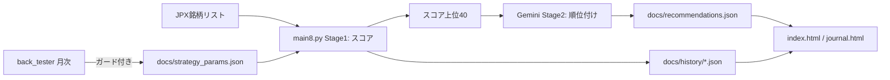

# プロジェクト現状ステータス（最新）

> このファイルが「いま何が実装済みで、何が残っているか」の最新情報源です。
> 新しいセッションは **このファイル＋[`back_tester/README.md`](back_tester/README.md)** を読めば全体像を把握できます。
> 設計の背景は [`IMPROVEMENT_PLAN.md`](IMPROVEMENT_PLAN.md) を参照（※実装が進み一部古い）。
> コミュニケーションは **日本語のみ**（[`AGENTS.md`](AGENTS.md)）。

---

## 0. 30秒サマリ

- 日本株スクリーナー（プライム+スタンダード 約3,100銘柄）。全銘柄をスキャン → **スコア上位40を AI（Gemini）が順位付け** → 「推奨/様子見」を提示。
- **スコアは Phase 2 の「トレンド合成」**（52週高値位置・200日線乖離・200日線傾き・120日リターン）。
- バックテストは**同一リポジトリ内の [`back_tester/`](back_tester/)**。**毎月 第1土曜にガード付きで `docs/strategy_params.json` へ自動反映**。
- フロントは GitHub Pages（[`docs/index.html`](docs/index.html) / [`docs/journal.html`](docs/journal.html)）。
- ワークフローは3本（技術スクリーニング / AI分析 / バックテスト）。

---

## 1. リポジトリ構成

- **単一リポジトリ（`Stock_app`）**。バックテストは [`back_tester/`](back_tester/) 配下。
- 旧 `back_tester` リポジトリ（別リポジトリ）は **GitHub 上でアーカイブ済み**（読み取り専用・履歴のバックアップ）。
- `common/`（`config.py` / `features.py`）と `docs/strategy_params.json` は**リポジトリ直下で単一管理**（複製なし）。
- `main.py`〜`main7.py` は旧版（退避）。**現行は [`main8.py`](main8.py)**。

```
Stock_app/
├── main8.py                      # 現行スクリーナー（Stage1 スコア + Stage2 AI）
├── common/{config.py,features.py}# 共通（特徴量・スコア・パラメータ読込）
├── docs/                         # GitHub Pages 兼 出力
│   ├── index.html / journal.html # フロント
│   ├── strategy_params.json      # 単一情報源（バックテストが自動更新）
│   ├── history/                  # 日次データ（{date}.json / latest.json / meta.json / dates.json）
│   ├── recommendations.json      # AIおすすめ / recommendations_technical.json（技術のみ）
│   ├── ai_analysis/{date}.json   # AI応答キャッシュ / ai_strategy_latest.json（銘柄別最新）
│   └── earnings.json             # 決算接近の警告データ
├── data/{stocks.db,price_cache}  # DB・価格キャッシュ
├── back_tester/                  # バックテスト（下記 7章）
│   ├── backtest_rolling_walkforward.py
│   ├── apply_optimal_params.py
│   ├── research_signals.py
│   └── results/
└── .github/workflows/            # daily_main8 / daily_main8_ai / run_walkforward
```

---

## 2. データの流れ



- **Stage1（無料・ローカル）**: 全銘柄の技術スコアを計算し、上位40を候補プールに。
- **Stage2（Gemini）**: プールを構造化データ＋ニュースで順位付け（`recommend`/`watch` 等）。画像は使わない。
- **バックテスト（月次）**: スコア／エグジットを検証し、ガード通過分を `docs/strategy_params.json` へ自動反映。

---

## 3. スコア（最重要）

**Phase 2: トレンド合成スコア（0〜100）** — [`common/features.py`](common/features.py) の `compute_technical_score`。

| 成分 | 重み | 変換 |
| :--- | ---: | :--- |
| `pos_52w`（52週高値からの位置 = 終値/252日高値） | 30 | そのまま 0〜1 |
| `dist_sma200`（200日線からの乖離 = 終値/SMA200 − 1） | 25 | ÷0.30 して 0〜1 |
| `sma200_slope`（200日線の20営業日変化率） | 25 | ÷0.10 して 0〜1 |
| `ret_120d`（120日リターン） | 20 | ÷0.60 して 0〜1 |

- 各成分は 0〜1 にクランプして加算（NaN/負は0）。**トレンド系のみ・相対化なしの絶対スコア**。
- **旧成分（日足GC・出来高増加率・週足トレンド）は Phase 1 の研究で逆効果のため廃止**。

**経緯（Phase 0/1/2）**
- Phase 0: 旧スコアは「上位ほど上がる」関係を示せず、上位選択がランダムに劣後。成分では「200日線より上」以外の寄与が小さく、出来高急増・GC直後・週足上昇は**分位スプレッドがマイナス（逆効果）**。
- Phase 1: 候補指標を分位分析（[`research_signals.py`](back_tester/research_signals.py)）。**200日線の傾き・乖離・52週高値位置・120日リターン**が有力。
- Phase 2: 上記でスコアを再構成。**分位スプレッド +0.025% → +0.347%**、**Spearman 0.24 → 0.92**、上位分位 +0.16% / 下位分位 −0.19%。

---

## 4. スクリーナー（[`main8.py`](main8.py)）

- 全銘柄を一括スキャン。価格は増分キャッシュ（`data/price_cache`、**約400暦日**取得）。ファンダ（PER/PBR/ROE/配当）は yfinance `.info` から。
- 候補プール = スコア上位 `stage1_pool_max`（40）。
- **おすすめの並び**（`build_recommendations`）: **判定優先度 → AI順位 → スコア → 出来高増加率 → 流動性**。
  - 判定優先度: `recommend`(0) → `watch`(1) → `neutral`(2) → `hold`(3) → `caution`(4) → `avoid`/`sell`(5) → AIなし(9)。
  - **業種集中の上限**: `portfolio.max_per_sector`（既定2）を守り、同一業種は最大2銘柄まで採用。
- **エグジットは「ルール基本」**: 利確 = 価格×(1+`price_tiers.tp_pct`)、損切 = 価格 − `price_tiers.atr_sl_mult`×ATR14。**AIの tp/sl は `advice` に参照保持**（表示上はルール優先）。
- **リスクベースの推奨株数**: `参考資金 × risk% ÷ 損切幅`（`portfolio` セクション）。
- **決算接近の警告**: スキャン時の `.info` から次回決算日を抽出（`earningsTimestampStart`、追加通信なし）→ `docs/earnings.json` とおすすめに `earnings_date`/`earnings_soon`。
- **地合い**: `1306.T`（TOPIX ETF）が200日線より上か（risk-on/off）を `meta.json.regime` に出力（**表示のみ・選定フィルタはOFF**）。
- **Discord通知**: 推薦ランキングを送信（AI実行時はAI順位＋総評、通常実行時はスコア順）。利確/損切は価格帯別ルール値。
  - 送信先は環境変数 `DISCORD_WEBHOOK_URL`。**`daily_main8.yml`（通常）は同変数を設定していないため、実際に通知されるのは AI実行（`daily_main8_ai.yml`）のみ**。通常回はデータ更新が無ければ「株価データ変更なし」通知になる。
- フラグ: `--ai`（AI実行）/ `--force-ai`（当日キャッシュを無視して再実行）/ `--no-discord` / `--max-stocks`。

---

## 5. フロント

- [`docs/index.html`](docs/index.html): 統合スクリーナー。
  - 一覧バッジ: **最新AI実行日**の銘柄は `⭐AI #順位`、**過去バッチ**の銘柄は `⭐AI MM-DD`（順位なし・薄表示の参考）＋判定（推奨/様子見/中立/注意/回避）。`excluded` 銘柄は非表示。※rankは回ごとの順位のため日付をまたいで混在させない。
  - ヘッダ: **地合い risk-on/off** と **推奨ポートフォリオ（最大N銘柄・1取引リスク%）**。
  - デフォルト並び替え: **AI推奨順**（推奨→様子見→中立→保有→注意→回避→順位）。他にスコア順など。
  - 銘柄モーダル: 銘柄詳細＋**価格帯別ルールの利確/損切（ATR損切）**＋**推奨株数**＋決算警告。AI戦略は**参考情報（売買指示には未採用）**と明示。「最新AI実行」ボタンは**常時有効**（プロンプトをコピーしてGeminiへ）。
- [`docs/journal.html`](docs/journal.html): 取引記録。**銘柄名クリックで index と同じモーダル**を表示。`strategy_params` / `recommendations` / `meta` を読み、利確/損切・推奨株数を index と統一。OCO既定値とCSV取込も価格帯別ルールで算出。
- 旧 `main7.html` / `index_main6_backup.html` は退避。

---

## 6. AI（Gemini）

- 環境変数 `GEMINI_API_KEY`（GitHub Secrets）。`ai.provider` / `ai.model` で切替。
- **既定モデル: `gemini-3.6-flash`**（フォールバック: `gemini-3.1-pro-preview`）。
- リトライ: 5xx は最大5回（指数バックオフ）、**課金クォータ 429 は即スキップ**。
- 応答の `code` を文字列正規化して候補プールと突合（`sanitize_ai_map`）。
- `verdict` は `recommend/watch/neutral/caution/avoid` に限定（プロンプトで明示）。main8・フロント双方で同じ優先順位に正規化。
- AI入力には `過熱警戒（warnings）` `決算（接近時はあとN日）` `グレアム理論株価/割安度` `価格帯` を含む。
- yfinance の 401/429（想定内）はログ抑制（`logging.getLogger("yfinance")`）。
- 出力: `ai_analysis/{date}.json`（生キャッシュ）＋ `ai_strategy_latest.json`（銘柄別最新）。

---

## 7. バックテスト & 自動反映（[`back_tester/`](back_tester/)）

- [`backtest_rolling_walkforward.py`](back_tester/backtest_rolling_walkforward.py): スクリーナーと**同一スコア式**のウォークフォワード（学習12ヶ月/検証3ヶ月/スライド3ヶ月）。
  - エントリー: スコア上位K（既定5）を翌日寄り。エグジット: 固定TP/SL vs ATRトレーリング。**株価帯別に最適化**。
  - **選定エッジ検証**: `quantile_analysis` / `selection_comparison`（上位vsランダムvs下位）/ `weight_ablation`（leave-one-out）/ `atr_trail_worst_trades`（テール監査）/ `regime_effect`（地合い無し・指数MA・breadth）/ `position_sizing_effect`（同時保有数 3/4/5/8）。
  - 出力: `results/backtest_walkforward_result.json`（上記キー含む）・`.csv`・`backtest_tier_exit.csv`・`_report.md`。
- [`research_signals.py`](back_tester/research_signals.py): 候補指標（14種・業種相対強度 `sector_rs_20d` 含む）の分位スプレッド研究 → `results/research_signals.json/.csv`。
- [`apply_optimal_params.py`](back_tester/apply_optimal_params.py): 結果を**ガード付き**で `docs/strategy_params.json` の `signals`・`price_tiers` に反映。
  - ガード: 最低100件 / OOS PF≧1.15 / 期待値>0 / 年率>ベンチマーク / DD≦50% / （signals）近傍安定性 / 前回比劣化なし。
- [`run_walkforward.yml`](.github/workflows/run_walkforward.yml): **毎月 第1土曜 21:00 JST**。バックテスト→ガード反映→`docs/strategy_params.json` と `results/` をコミット（**手動同期不要**）。

### 直近の検証所見（2022-01〜2026-08）
- 新スコア: 分位スプレッド **+0.347%** / Spearman **0.92**（上位分位 +0.16% / 下位分位 −0.19%）。
- 選定比較: 上位 PF 1.04 / 年率 +16.2% / DD 35.1%、ランダム PF 1.14、下位 PF 0.88（**上位>下位は明確、PFではランダムと同等**）。
- **同時保有数**: 本期間は **4銘柄が最良**（年率 +37.6% / DD 31.9%）。ただし単一経路のため**既定ガイドは5のまま**。
- **地合いフィルタは不採用**: 指数MA・breadth いずれも年率を下げDDを悪化。既定OFF、`regime_effect` で毎回計測。
- **業種相対強度は不採用**: `sector_rs_20d`（同業種平均からの20日リターン超過）は分位スプレッド **−0.162%** / Spearman **−0.139** / プラス期間率 0.286 とマイナス（2026-09-20 検証）。スコアに採用しない。

---

## 8. 主要パラメータ（[`docs/strategy_params.json`](docs/strategy_params.json)）

- `score_weights`: `{pos_52w:30, dist_sma200:25, sma200_slope:25, ret_120d:20}`
- `price_tiers`: 価格帯ごとの `tp_pct` / `sl_pct` / `max_hold_days` / `atr_sl_mult`（バックテストが自動更新）
- `portfolio`: `{max_positions:5, max_per_sector:2, risk_per_trade_pct:1.0, reference_capital_jpy:1000000}`（`max_per_sector` は同一業種の同時採用上限）
- `signals`: gc_window 等（新スコアでは未使用。出力互換のため保持）
- `warnings`: 低位/中位の出来高4倍超の警告
- `ai`: `{enabled, provider:gemini, model:gemini-3.6-flash, stage1_pool_max:40, weekly_top_picks:5, ...}`（`stage1_pool_min` は定義のみで**未使用**）

---

## 9. 出力ファイル

- `docs/history/{date}.json` / `latest.json`: 全銘柄レコード（スコア付き）。
- `docs/history/meta.json`: `{date, generated_at, regime, portfolio}`。
- `docs/recommendations.json`（AI時）/ `recommendations_technical.json`（技術のみ）: `{regime, portfolio_guide, picks[]}`。
  - `picks[]`: `code,name,price,score,verdict,rank,tp_price,sl_price,ai_tp_price,ai_sl_price,atr_sl_mult,stop_distance,suggested_qty,trailing_plan,earnings_date,earnings_soon,...`
- `docs/earnings.json`: `{date, horizon_days:14, items:{code:{date,days_until,soon}}}`。
- `docs/ai_analysis/{date}.json` / `ai_strategy_latest.json`。
- `data/stocks.db`（ファンダ・履歴キャッシュ）。

---

## 10. 実行方法（クイック）

```bash
# スクリーナー（技術のみ）
uv run --no-project --python 3.11 --with pandas --with numpy --with requests --with yfinance --with openpyxl --with xlrd python main8.py

# スクリーナー（AI分析）
uv run --no-project --python 3.11 --with pandas --with numpy --with requests --with yfinance --with openpyxl --with xlrd python main8.py --ai

# AIを強制再分析
uv run --no-project --python 3.11 --with pandas --with numpy --with requests --with yfinance --with openpyxl --with xlrd python main8.py --ai --force-ai

# バックテスト
uv run --no-project --python 3.11 --with pandas --with numpy --with requests --with yfinance --with openpyxl --with xlrd python back_tester/backtest_rolling_walkforward.py
```

- ワークフロー実行時は、**どのワークフローを実行するか宣言してから**実行する（`AGENTS.md`）。
- ワークフロー: `daily_main8.yml`（平日5回）/ `daily_main8_ai.yml`（20:17 JST）/ `run_walkforward.yml`（月次）。

---

## 11. 残タスク・既知の制約

**残タスク**
- エグジット係数（ATR損切・トレーリング・部分利確）の区分別最適化の拡張。
- 同時保有数の頑健性検証（単一経路依存の解消）。
- スコアのランダム対比での優位性向上（現状はリターンで勝ち・PFは同等）。
- 業種・相場レジームのセグメント検証、決算日除外の検証。
- ジャーナルのサーバー側永続化＋エントリー時特徴量スナップショット（現状 localStorage）。

**既知の制約**
- **画像入力なし**: AIはチャート画像を見ない（OHLC由来の数値で近似）。
- **決算日データ**: yfinance 由来で一部古い。**未来の決算日が取れた場合のみ**警告。
- **ライブニュース**: yfinance `.news`。日本株・小型株は網羅度が低く「要確認」が多い。
- **サバイバーシップバイアス / 多重検定**: バックテスト結果はやや楽に出る／偶然の好成績に注意。ガードで緩和。
- **プリセットは未検証**: index.html の「3大実証厳選」等の PF 値は削除済みの旧バックテスト由来（UI上「⚠未検証」表示）。
- **ポートフォリオ指標は実現損益ベース**（保有时価評価なし）。
- **Python**: ローカルは `uv run --no-project --python 3.11 ...`（システムPython未導入）。

---

## 12. 主要な変更履歴（概要）

- 単一リポジトリ統合（back_tester を Stock_app へ）。旧リポジトリはアーカイブ。
- Gemini モデル名修正（`gemini-3.6-flash`）＋リトライ／クォータ対応。応答コード正規化。
- 一覧の AI 順位・判定バッジ、日付整合、AI推奨順ソート。
- スコア再設計（Phase 0→1→2、トレンド合成）。
- 資金配分ガイド・推奨株数、決算接近の警告、ルール基本エグジット、地合い表示。
- バックテストに選定エッジ検証・地合い比較・同時保有数比較を追加し、自動反映を単一リポジトリで実現。
